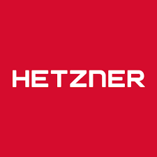
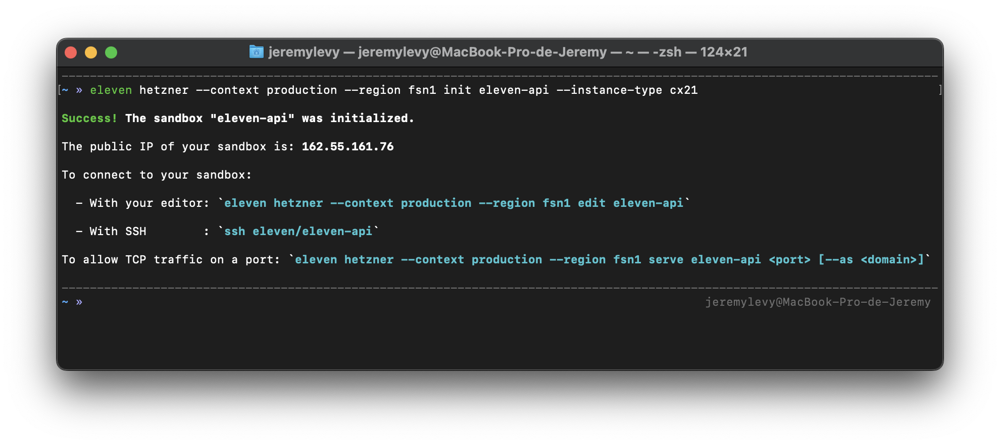
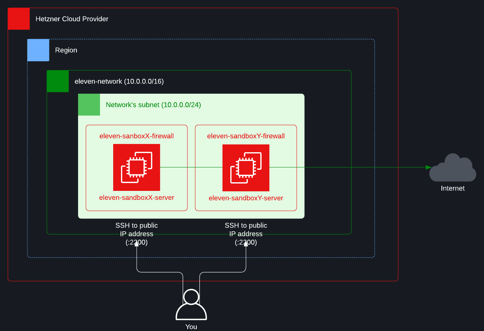

<p align="center">
  
</p>

<p align="center">
    <h1 align="center">Hetzner Cloud Provider</h1>
    <p align="center">This repository contains the source code that implements the Hetzner cloud provider for the <a href="https://github.com/eleven-sh/cli">Eleven CLI</a>.</p>
</p>

```bash
eleven hetzner --context production --region fsn1 init eleven-api --instance-type cx21
```
<p align="center">
  
</p>

## Table of contents
- [Usage](#usage)
    - [Authentication](#authentication)
        - [--context](#--context)
        - [--region](#--region-and-hcloud_region)
    - [Permissions](#permissions)
    - [Authorized instance types](#authorized-instance-types)
- [Infrastructure components](#infrastructure-components)
    - [Init](#init)
    - [Edit](#edit)
    - [Serve](#serve)
    - [Unserve](#unserve)
    - [Remove](#remove)
    - [Uninstall](#uninstall)
- [Infrastructure costs](#infrastructure-costs)
- [License](#license)

## Usage

```console
To begin, create your first sandbox using the command:
	
  eleven hetzner init <sandbox_name>
	
Once created, you may want to connect your editor to it using the command: 
	
  eleven hetzner edit <sandbox_name>
	
If you don't plan to use this sandbox again, you could remove it using the command:
		
  eleven hetzner remove <sandbox_name>

Usage:
  eleven hetzner [command]

Examples:
  eleven hetzner init eleven-api --instance-type cx21 
  eleven hetzner edit eleven-api
  eleven hetzner remove eleven-api

Available Commands:
  edit        Connect your editor to a sandbox
  init        Initialize a sandbox
  remove      Remove a sandbox
  serve       Allow TCP traffic on a port
  uninstall   Uninstall Eleven
  unserve     Disallow TCP traffic on a port

Flags:
      --context string   the configuration context to use to access your Hetzner account
  -h, --help             help for hetzner
      --region string    the region to use to access your Hetzner account

Use "eleven hetzner [command] --help" for more information about a command.
```

### Authentication

In order to access your Hetzner account, the Eleven CLI will first look for credentials in the following environment variable:

- `HCLOUD_TOKEN`

If not found, the configuration files created by the Hetzner CLI (via `hcloud context create`) will be used.

#### --context

If you have configured the Hetzner CLI with multiple configuration contexts, you could tell Eleven which one to use via the `--context` flag:

```shell
eleven hetzner --context production init eleven-api
```

**By default, Eleven will use the `active` context.**

#### --region and HCLOUD_REGION

If you want to overwrite the region resolved by the Eleven CLI, you could use the `--region` flag:

```shell
eleven hetzner --region fsn1 init eleven-api
```

```shell
eleven hetzner --context production --region fsn1 init eleven-api
```

or the `HCLOUD_REGION` environment variable:

```shell
export HCLOUD_REGION=fsn1
```

**The `--region` flag takes precedence over the `HCLOUD_REGION` environment variable.**

### Permissions

Your API token needs to have `Read & Write` permissions. (See the next sections to learn more about the actions that will be done on your behalf).

### Authorized instance types

To be used with Eleven, the chosen instance must be **<ins>a cloud instance</ins>**.

#### Examples

```shell
cx11, cpx31, cx51...
```

## Infrastructure components



The schema above describe all the components that may be created in your Hetzner account. The next sections will describe their lifetime according to your use of the Eleven CLI.

### Init

```bash
eleven hetzner init eleven-api
eleven hetzner init eleven-api --instance-type cx11
```

#### The first time Eleven is used in a region

When running the `init` command for the first time in a region, the following components will be created:

- A `network` named `eleven-network` with an IPv4 CIDR block equals to `10.0.0.0/16` to isolate your infrastructure.

- A `subnet` with an IPv4 CIDR block equals to `10.0.0.0/24` that will contain the servers running your sandboxes.

#### On each init

Each time the `init` command is run for a new sandbox, the following components will be created:

- A `server` named `eleven-${SANDBOX_NAME}-server` with a type equals to the one passed via the `--instance-type` flag **or `cx11` by default**.

- A `firewall` named `eleven-${SANDBOX_NAME}-firewall` to let the server accepts `TCP` connections on served ports.

- An `SSH key` named `eleven-${SANDBOX_NAME}-ssh-key` to let you access the server via `SSH`.

### Edit

```bash
eleven hetzner edit eleven-api
```

When running the `edit` command, nothing will be done to your infrastructure.

### Serve

```bash
eleven hetzner serve eleven-api 8080
eleven hetzner serve eleven-api 8080 --as api.eleven.sh
```

When running the `serve` command without the `--as` flag, an `inbound` rule will be added to the `firewall` of the server running your sandbox. 

This rule will allow all `TCP` traffic from `any IP address` to the specified port.

**When the `--as` flag is used, nothing is done to your infrastructure**.

### Unserve

```bash
eleven hetzner unserve eleven-api 8080
```

When running the `unserve` command, the `inbound` rule added by the `serve` command will be removed.

### Remove

```bash
eleven hetzner remove eleven-api
```

When running the `remove` command, all the components associated with the sandbox will be removed.

In other words:

- The `server`.

- The `firewall`.

- The `SSH key`.

### Uninstall

```bash
eleven hetzner uninstall
```

When running the `uninstall` command, all the components shared by your sandboxes **in the resolved region** will be removed.

In other words:

- The `subnet`.

- The `network`.

## Infrastructure costs

The cost of running a sandbox on Hetzner is equal to the cost of the `server` used.

## License

Eleven is available as open source under the terms of the [MIT License](http://opensource.org/licenses/MIT).
